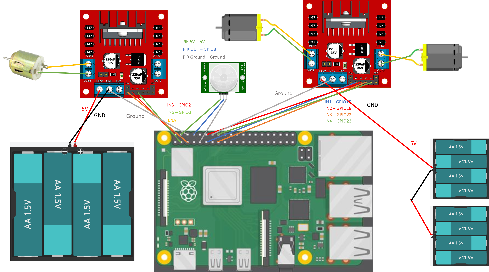

# Domino Stacking Robot Car

112403026 魏仁祥 資管三

## Overview
This document explains how to create an **Automatic Domino Stacking Robot Car** using a Raspberry Pi. The project integrates a mobile robot chassis with a custom domino dispensing mechanism. By following this guide, you will learn how to configure the hardware and software to build a functional robot capable of moving and automatically laying down dominoes in a path. The robot is controlled via a Flask-based web application, providing a modern and responsive interface for navigation and domino control.

## Features
*   **Remote Control:** Navigate the robot car (Forward, Backward, Left, Right) using a web-based interface.
*   **Domino Dispensing:** Toggle the domino dispensing mechanism on and off.
*   **Smart Stop (Domino Detection):** Integrated PIR sensor monitors the domino supply. If the dominos run out, the car automatically stops moving to prevent empty runs.

## Required Components

### Software
*   **Raspberry Pi OS** (Raspbian Buster)
*   **Python 3.x**
*   **Libraries:**
    *   `Flask` (Web Server)
    *   `RPi.GPIO` (Hardware Control)

### Hardware
*   **Raspberry Pi 4B** 
*   **Motor Controller L298N** for wheel motors and domino servo
*   **DC Motors** (2x for wheels)
*   **Domino Dispensing Mechanism** (with DC Motor)
*   **PIR Sensor** (for domino detection)
*   **Robot Car Chassis**: [Smart Car Chassis Kit](https://jin-hua.com.tw/page/product/show.aspx?num=32270&lang=TW)
*   **Battery Pack** 
*   **Power Bank** (for Raspberry Pi)
*   **Jumper Wires** (Male-to-Male, Male-to-Female, Male-to-Female)

## Chassis Assembly
The chassis kit comes with the following components that need to be assembled first:

*   **Chassis** x1
*   **DC Motors** x2
*   **Tires** x2
*   **Universal Wheel** x1
*   **Encoder Disks** x2
*   **T-Brackets** x4
*   **Battery Box** x1
*   **Switch** x1
*   **Fasteners**:
    *   M3*30 Screws x4
    *   M3*8 Screws x2
    *   M3*6 Screws x8
    *   M3 Nuts x6
    *   10mm Copper Pillars x4

Please assemble the chassis according to the kit instructions before mounting the Raspberry Pi and other components.

## Pre-installation

### 1. Setup Raspberry Pi
1.  Install Raspberry Pi OS on your SD card using [Raspberry Pi Imager](https://www.raspberrypi.org/software/).
2.  Enable SSH and connect to your WiFi network.
3.  Update your system:
    ```bash
    sudo apt update
    sudo apt upgrade
    ```

### 2. Install Required Libraries
Install Python 3 and pip if not already installed:
```bash
sudo apt install python3 python3-pip
```

Install the Flask web framework:
```bash
pip3 install flask
```

Ensure RPi.GPIO is installed (usually pre-installed on Raspberry Pi OS):
```bash
pip3 install RPi.GPIO
```

## Hardware Connections

### GPIO Pin Configuration (BCM Mode)
This project uses the **BCM** numbering scheme. Connect your components to the Raspberry Pi GPIO pins as follows:

#### Left Motor (Wheels)
*   **IN1**: GPIO 17
*   **IN2**: GPIO 18
*   **ENA (PWM)**: GPIO 5

#### Right Motor (Wheels)
*   **IN3**: GPIO 22
*   **IN4**: GPIO 23
*   **ENB (PWM)**: GPIO 6

#### Domino Dispenser Motor
*   **IN5**: GPIO 2
*   **IN6**: GPIO 3
*   **ENA (PWM)**: GPIO 4
#### Sensors
*   **PIR Sensor (Domino Detection)**: GPIO 8




*Note: Ensure the grounds (GND) of the Raspberry Pi, Motor Driver, and Battery are connected together.*

## Implementation

### 1. Motor Control Logic (`motor.py`)
The robot's movement is controlled by manipulating the GPIO pins connected to the motor driver.

*   **Forward**: Left and Right motors rotate forward.
*   **Backward**: Left and Right motors rotate backward.
*   **Turn Left**: Left motor stops/reverses, Right motor moves forward.
*   **Turn Right**: Left motor moves forward, Right motor stops/reverses.
*   **Stop**: All wheel motors stop.

### 2. Domino Mechanism
The domino dispenser is based on the "Pink and Green Domino Machine II" design by gzumwalt. It features a vertically stacked domino dispensing mechanism that uses a piston-driven arm to push dominoes out one by one.

*   **Mechanism Source**:
    *   [Pink and Green Domino Machine II on Instructables](https://www.instructables.com/Pink-and-Green-Domino-Machine-II/)
    *   [Pink and Green Domino Machine II on Cults3D](https://cults3d.com/en/3d-model/gadget/pink-and-green-domino-machine-ii)

*   **How it Works**:
    The mechanism uses a DC gear motor to drive a worm gear, which in turn drives a set of gears and linkages. This system converts the rotary motion of the motor into a reciprocating motion for a piston and a swinging motion for a domino arm.
    1.  **Loading**: Dominoes are stacked vertically in a funnel.
    2.  **Dispensing**: As the motor turns, the piston pushes the bottom domino out from the stack.
    3.  **Placement**: The domino arm guides the domino to the ground, ensuring it stands upright.
    4.  **Timing**: The gear ratio and linkage design ensure that dominoes are dispensed at regular intervals as the robot moves forward.

*   **Control**:
    *   **Domino Run**: Activates the dispenser motor (IN5 High, IN6 Low) and sets PWM duty cycle to 50% to push dominoes out.
    *   **Domino Stop**: Deactivates the dispenser motor and sets PWM to 0%.

### 3. Smart Stop System
The robot features an intelligent monitoring system to ensure smooth operation.
*   **Sensor**: A PIR sensor is positioned to detect the presence of dominos in the feed mechanism.
*   **Logic**: A background thread continuously checks the sensor status. If the sensor indicates that the domino stack is empty (signal HIGH), the system triggers an immediate stop command (`stop()` and `dominoStop()`), preventing the robot from driving without dispensing dominos.

### 4. Web Interface (`app.py` & `index.html`)
A Flask web server hosts a control panel accessible from any browser on the same network.

*   **D-Pad Controls**: Send JSON requests to `/move` endpoint to control direction.
*   **Domino Toggle**: Sends JSON requests to `/domino` endpoint to start/stop the stacking mechanism.
*   **Status Feedback**: The web page displays real-time status updates from the robot.

## How to Run

1.  **Clone the Project** (or copy files to your Raspberry Pi):
    Ensure you have `app.py`, `motor.py`, and the `templates/index.html` folder structure.

2.  **Start the Server**:
    Navigate to the project directory and run:
    ```bash
    sudo python3 app.py
    ```
    *Note: `sudo` is often required for GPIO access.*

3.  **Access the Control Panel**:
    Open a web browser on your computer or phone and go to:
    `http://<your-raspberry-pi-ip>:5000`

## Code Structure

```
iot_final_project/
├── app.py              # Flask web server and route handlers
├── motor.py            # Low-level GPIO control for motors and domino mechanism
└── templates/
    └── index.html      # Web control interface
```

## References
*   **Raspberry Pi Documentation**: https://www.raspberrypi.com/documentation/
*   **L298N 串接 2個直流馬達(ZK-2WD)**: https://hackmd.io/@resppi4/rJ-ReruVw
*   **Flask Documentation**: https://flask.palletsprojects.com/
*   **RPi.GPIO**: https://pypi.org/project/RPi.GPIO/
*   **[PIR] 使用人體紅外線感應 (PIR) 模組，製作家中安全防護及警報系統**: https://ruten-proteus.blogspot.com/2013/03/PIR-home-security-system.html

## My videos
- [骨牌機器人介紹](https://youtube.com/shorts/L8DvqLvfPbo)
- [骨牌機器人試跑](https://studio.youtube.com/video/NU4g4P6t3o0/edit)
- [修理 3D 列印機](https://youtu.be/--k16ZYcSBU)


## Acknowledgments
Special thanks to the course instructors and peers for their support in building this IoT project.
